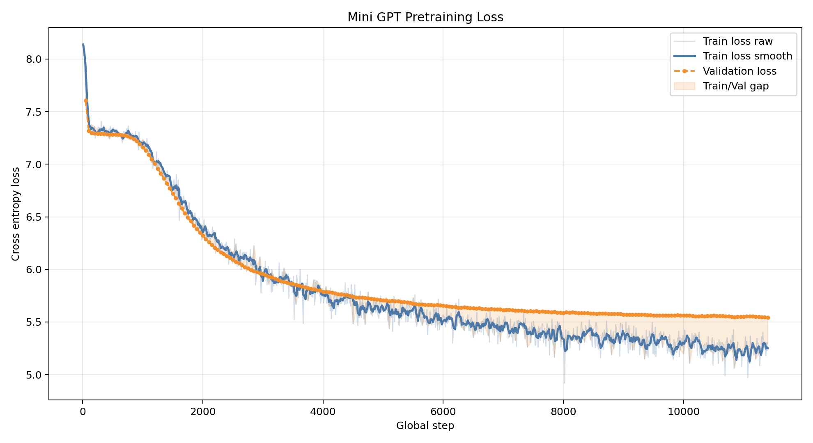
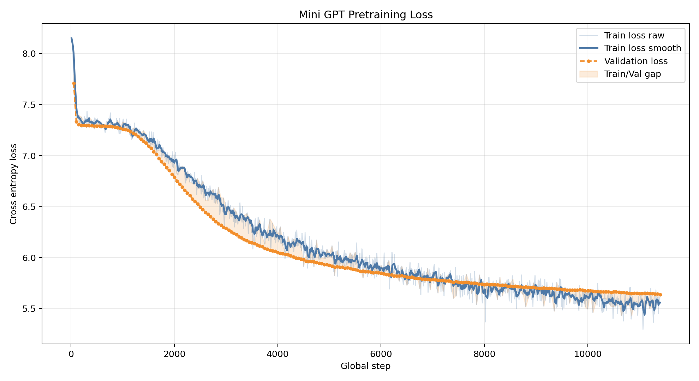
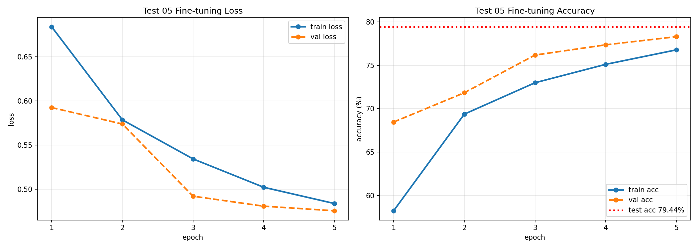

# Mini GPT LLM 구현 최종 보고서

## 0. 반·팀원

| 항목 | 내용 |
| --- | --- |
| 반 | AI 302반 |
| 팀명 | 5팀 |
| 팀원 | 이정현, 황선호, 이시준, 이재혁 |
 

## 1. 구현 현황

이번 과제에서는 외부 LLM 라이브러리 없이 PyTorch 기반 mini GPT를 구현했다.

| 단계 | 구현 내용 | 파일 |
| --- | --- | --- |
| 1 | UTF-8 byte-level BPE tokenizer | `src/bpe.py` |
| 2 | GPTDataset, DataLoader, InputEmbedding | `src/dataset.py`, `src/embeddings.py` |
| 3 | Causal Multi-Head Self-Attention | `src/attention.py` |
| 4 | LayerNorm, GELU, FeedForward, TransformerBlock, GPTModel | `src/model.py` |
| 5 | loss 계산, generate, checkpoint, pretraining loop | `src/train.py` |
| 6 | NSMC 감성 분류 Dataset, classification head, train/evaluate | `src/finetune.py` |

전체 흐름은 다음과 같다.

```text
텍스트
-> BPE tokenizer
-> token ids
-> token embedding + position embedding
-> TransformerBlock
-> 사전학습: 다음 token 예측
-> 미세튜닝: 리뷰 긍정/부정 분류
```

## 2. 테스트 통과 현황

구현 단계별 테스트를 통과한 뒤 실험을 진행했다.

| 테스트 파일 | 확인 내용 |
| --- | --- |
| `tests/test_bpe.py` | BPE tokenizer 초기화, train, save/load, encode/decode |
| `tests/test_dataset.py` | sliding window dataset, dataloader, embedding |
| `tests/test_attention.py` | multi-head attention shape, causal mask |
| `tests/test_model.py` | GPTModel forward, loss, generation |
| `tests/test_train.py` | loss 계산, checkpoint, generation, training utility |
| `tests/test_finetune.py` | sentiment dataset, classifier, train/evaluate |

## 3. 데이터

기본 데이터는 NAVER Sentiment Movie Corpus(NSMC)를 사용했다.

| 항목 | 내용 |
| --- | --- |
| 원본 train | `data/ratings_train.txt` |
| 원본 test | `data/ratings_test.txt` |
| 사전학습 train | `data/nsmc_lm_train.txt` |
| 사전학습 validation | `data/nsmc_lm_val.txt` |
| 감성 분류 train/val/test | NSMC 리뷰와 label을 사용 |

사전학습은 리뷰 텍스트를 이어 붙여 다음 token 예측 문제로 만들었다.

미세튜닝은 리뷰 하나를 입력으로 받아 긍정 `1`, 부정 `0`을 예측하는 classification 문제로 바꾸었다.

## 4. BPE

| 항목 | 내용 |
| --- | --- |
| 방식 | UTF-8 byte-level BPE |
| vocab size | 3000 |
| 특수 토큰 | `<pad>=0`, `<unk>=1`, `<bos>=2`, `<eos>=3` |
| byte token 범위 | ID 4~259 |
| merge token 범위 | ID 260 이상 |
| vocabulary 저장 | `data/nsmc_bpe_vocab_3000.json` |

BPE를 직접 구현한 이유는 한국어를 포함한 모든 문자를 `<unk>`에 의존하지 않고 byte 단위로 표현하기 위해서다.

특히 한글은 UTF-8에서 보통 3 byte로 표현되므로, byte-level BPE를 사용하면 처음 보는 단어도 byte 조합으로 처리할 수 있다.

## 5. 모델 구조

| 항목 | 값 |
| --- | --- |
| 구조 | InputEmbedding -> TransformerBlock x 2 -> LayerNorm -> LM head |
| vocab size | 3000 |
| context length | 64 |
| embedding dim | 128 |
| attention heads | 4 |
| transformer layers | 2 |
| qkv bias | False |
| optimizer | AdamW |
| weight decay | 0.01 |

사전학습에서 모델은 각 위치마다 다음 token을 예측한다.

미세튜닝에서는 GPT backbone 위에 별도의 classification head를 붙여 리뷰 전체가 긍정인지 부정인지 예측했다.

## 6. 사전학습 실험

사전학습에서는 dropout 값을 바꿔가며 train loss, validation loss, train/validation gap을 비교했다.

### 6.1 사전학습 실험 요약

| 제출용 테스트 | 변경한 조건 | final train loss | final validation loss | gap `(val - train)` | 해석 |
| --- | --- | ---: | ---: | ---: | --- |
| Test 01 | 기본값, `drop_rate=0.1` | 5.3018 | 5.5441 | +0.2424 | validation loss는 가장 낮지만 gap이 큼 |
| Test 02 | `drop_rate=0.3` | 5.6488 | 5.6377 | -0.0110 | gap은 줄었지만 loss가 높음 |
| Test 03 | `drop_rate=0.2` | 5.4828 | 5.5774 | +0.0947 | 성능과 gap의 균형이 가장 좋음 |

### 6.2 Test 01 - 기본 사전학습

**가설:** step 제한 없이 기본 설정으로 충분히 학습하면 train loss와 validation loss가 모두 감소할 것이다.

**결과:** final validation loss는 5.5441로 세 사전학습 실험 중 가장 낮았다. 하지만 train/validation gap이 +0.2424로 가장 크게 벌어졌다.



**다음 가설:** validation loss는 낮지만 gap이 크므로, dropout을 강하게 주면 과적합 가능성을 줄일 수 있을 것이다.

### 6.3 Test 02 - Dropout 0.3

**가설:** `drop_rate=0.3`으로 규제를 강하게 주면 train/validation gap이 줄어들 것이다.

**결과:** gap은 -0.0110으로 거의 사라졌다. 하지만 validation loss가 5.6377로 높아졌다. 즉, 규제가 너무 강해 모델이 충분히 학습하지 못한 것으로 해석했다.



**다음 가설:** dropout 0.1과 0.3 사이의 값인 0.2를 사용하면 성능과 규제의 균형을 잡을 수 있을 것이다.

### 6.4 Test 03 - Dropout 0.2

**가설:** `drop_rate=0.2`는 Test 01보다 gap을 줄이고, Test 02보다 validation loss를 낮출 것이다.

**결과:** final validation loss는 5.5774, gap은 +0.0947이었다. Test 01보다 validation loss는 조금 높지만 gap이 줄었고, Test 02보다 validation loss가 낮았다.


**해석:** Test 03은 성능과 일반화 사이에서 가장 균형적인 checkpoint로 판단했다. 이후 미세튜닝 실험은 Test 03 사전학습 checkpoint를 기준으로 진행했다.

## 7. 미세튜닝 실험

미세튜닝에서는 NSMC 리뷰를 긍정/부정으로 분류했다.

### 7.1 미세튜닝 실험 요약

| 제출용 테스트 | 사전학습 checkpoint | 변경한 조건 | train samples | epoch | validation acc | test acc |
| --- | --- | --- | ---: | ---: | ---: | ---: |
| Test 03 | Test 03 | 기본 미세튜닝 | 20,000 | 10 | 76.16% | 76.50% |
| Test 04 | Test 03 | train data 증가 | 50,000 | 5 | 78.30% | 79.44% |
| Test 05 | Test 03 | 마지막 non-pad token 사용 | 20,000 | 10 | 76.76% | 77.44% |

### 7.2 Test 03 - 기본 미세튜닝

**가설:** Test 03 사전학습 checkpoint를 사용하면 NSMC 감성 분류에서도 70% 이상의 정확도를 얻을 수 있을 것이다.

**결과:** 10 epoch 후 test accuracy는 76.50%였다. validation accuracy는 76.16%까지 상승했다.


**해석:** 사전학습으로 얻은 표현을 classification head가 활용할 수 있음을 확인했다. 다만 validation loss가 epoch 9 이후 흔들려 추가 학습 시 과적합 가능성이 있었다.

**다음 가설:** learning rate를 낮추는 것보다 미세튜닝 데이터 수를 늘리면 더 다양한 리뷰 표현을 학습해 정확도가 올라갈 것이다.

### 7.3 Test 04 - 미세튜닝 데이터 수 증가

**가설:** fine-tuning train data를 20,000개에서 50,000개로 늘리면 test accuracy가 상승할 것이다.

**결과:** 5 epoch만 진행했지만 validation accuracy는 78.30%, test accuracy는 79.44%를 기록했다.



**Test 03과 비교:**

```text
Test 03 test accuracy: 76.50%
Test 04 test accuracy: 79.44%
개선 폭: +2.94%p
```

**해석:** 데이터 수 증가가 미세튜닝 성능 향상에 가장 직접적인 효과를 보였다. 같은 사전학습 checkpoint를 사용했기 때문에, 이 차이는 미세튜닝 데이터량 증가의 효과로 볼 수 있다.

**다음 가설:** 짧은 리뷰에서는 마지막 위치가 `<pad>`일 수 있으므로, 문장 대표 벡터를 마지막 위치가 아니라 마지막 실제 토큰 위치에서 가져오면 성능이 개선될 것이다.

### 7.4 Test 05 - PAD 위치 제외

**가설:** classification에서 마지막 위치 `x[:, -1, :]`를 사용하면 짧은 리뷰의 경우 `<pad>` 위치를 문장 대표 벡터로 사용할 수 있다. 마지막 non-pad token hidden state를 사용하면 정확도가 개선될 것이다.

**변경 전:**

```python
sentence_vec = x[:, -1, :]
```

**변경 후:**

```python
valid_mask = input_ids != pad_id
lengths = valid_mask.sum(dim=1).clamp(min=1)
last_indices = lengths - 1
sentence_vec = x[batch_indices, last_indices, :]
```

**결과:** Test 05의 test accuracy는 77.44%였다.


**Test 03과 비교:**

```text
Test 03 test accuracy: 76.50%
Test 05 test accuracy: 77.44%
개선 폭: +0.94%p
```

**해석:** 개선 폭은 크지 않지만, 구조적으로는 마지막 위치를 무조건 사용하는 것보다 마지막 실제 토큰을 사용하는 방식이 더 타당하다. 짧은 리뷰가 많은 데이터셋에서는 PAD 위치를 대표 벡터로 사용하는 문제가 실제 성능에 영향을 줄 수 있음을 확인했다.

## 8. 실험 환경

| 항목 | 내용 |
| --- | --- |
| Python | Python 3.11 권장, Colab에서는 Python 3.12 런타임 사용 |
| 주요 라이브러리 | PyTorch, NumPy, Matplotlib, pytest |
| 실행 환경 | Colab GPU 및 로컬 |
| 데이터 | NSMC |
| checkpoint 저장 | `experiments/outputs/*.pt` |
| 그래프 저장 | `experiments/outputs/*.png` |

Colab 런타임이 끊기면 `/content`의 checkpoint가 사라질 수 있어, 이후 실험에서는 Google Drive에 epoch별 checkpoint를 저장하는 방식이 필요하다고 판단했다.

## 9. 최종 결론

이번 과제에서는 BPE tokenizer부터 mini GPT, 사전학습, 감성 분류 미세튜닝까지 직접 구현했다.

사전학습에서는 dropout 값을 조정하며 loss와 gap을 비교했고, `drop_rate=0.2`가 성능과 일반화 사이의 균형이 가장 좋아 보였다.

미세튜닝에서는 세 가지 흐름을 확인했다.

| 결론 | 근거 |
| --- | --- |
| 사전학습 checkpoint는 미세튜닝에 활용 가능하다 | 기본 미세튜닝 test accuracy 76.50% |
| 데이터량 증가는 가장 큰 성능 개선을 만들었다 | 50,000개 미세튜닝 test accuracy 79.44% |
| PAD 위치 제외는 구조적으로 더 타당하고 성능도 개선했다 | padding-aware test accuracy 77.44% |

최종적으로 가장 높은 성능은 Test 04의 79.44%였다.

```text
최고 test accuracy: 79.44%
조건: Test 03 사전학습 checkpoint + fine-tuning train data 50,000개
```

## 10. 고찰

이번 실험에서 가장 중요한 발견은 정확도를 높이는 방법이 단순히 epoch를 늘리는 것이 아니라는 점이다.

사전학습에서는 validation loss만 낮은 모델보다 train/validation gap까지 함께 고려해야 했다.

미세튜닝에서는 learning rate를 먼저 바꾸기보다 데이터 수를 늘리는 것이 더 직접적인 개선을 만들었다.

또한 classification에서는 마지막 token hidden state를 사용할 때, padding이 들어간 입력에서는 실제 마지막 토큰 위치를 찾아야 한다는 점을 확인했다.

앞으로 개선한다면 다음 실험을 진행할 수 있다.

| 개선 방향 | 예상 효과 |
| --- | --- |
| Test 04 조건에서 10 epoch 전체 수행 | 데이터량 증가 효과의 최대치 확인 |
| best checkpoint를 validation loss 기준으로도 저장 | accuracy와 loss 기준 비교 |
| learning rate 5e-5 실험 | 더 안정적인 수렴 가능성 확인 |
| 더 큰 model size 실험 | 표현력 증가에 따른 성능 변화 확인 |
| Drive checkpoint 자동 저장 | Colab 런타임 끊김 대응 |
