# mini GPT 구현 과제 보고서

## 0. 반·팀원

| 항목 | 내용 |
| --- | --- |
| 반 | 302반 |
| 팀명 | 5조 |
| 팀원 | 이정현, 이재혁, 양시준, 황선호 |

---

## 1. 구현 현황

| 단계 | 구현 내용 | 구현 파일 | 담당자 |
| --- | --- | --- | --- |
| 1 | UTF-8 byte-level BPE tokenizer | `src/bpe.py` | 이정현 |
| 2 | GPTDataset, create_dataloader, InputEmbedding | `src/dataset.py`, `src/embeddings.py` | 이재혁 |
| 3 | MultiHeadAttention, causal mask | `src/attention.py` | 양시준 |
| 4 | LayerNorm, GELU, FeedForward, TransformerBlock, GPTModel, generate_text_simple | `src/model.py` | 황선호 |
| 5 | loss 계산, checkpoint 저장, 텍스트 생성, train loop | `src/train.py` | 공동 |
| 6 | NSMC 감성 분류 Dataset, GPT classifier, fine-tuning loop | `src/finetune.py` | 공동 |

구현 목표는 외부 pretrained model이나 외부 tokenizer vocabulary 없이 NSMC 데이터만으로 byte-level BPE를 만들고, GPT 뼈대 사전학습 후 감성 분류 미세 조정까지 연결하는 것이었다.

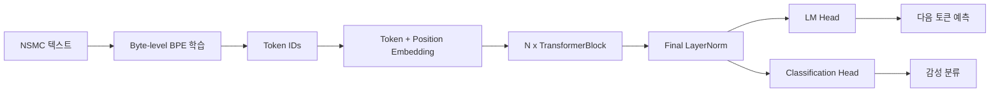

---

## 2. 테스트 통과 현황

| 실행 명령 | 결과 | 비고 |
| --- | --- | --- |
| `pytest tests/test_bpe.py -v` | 통과 | BPE encode/decode, vocab 저장/로드 확인 |
| `pytest tests/test_dataset.py -v` | 통과 | sequence slicing, dataloader shape 확인 |
| `pytest tests/test_attention.py -v` | 통과 | causal mask, attention output shape 확인 |
| `pytest tests/test_model.py -v` | 통과 | GPT forward, loss, generation 확인 |
| `pytest tests/test_train.py -v` | 통과 | loss 계산, checkpoint, sample generation 확인 |
| `pytest tests/test_finetune.py -v` | 통과 | 감성 Dataset, classifier, train/eval 확인 |
| `pytest tests/ -v` | 통과 | 전체 테스트 28개 통과, warning 1개 |

실패한 테스트는 없었다.

---

## 3. 데이터

| 항목 | 내용 |
| --- | --- |
| 원본 데이터 | NSMC |
| 원본 경로 | `data/ratings_train.txt`, `data/ratings_test.txt` |
| 사전 학습 데이터 | `data/nsmc_lm_train.txt`, `data/nsmc_lm_val.txt` |
| 미세 조정 데이터 | `data/nsmc_sentiment_train.jsonl`, `data/nsmc_sentiment_val.jsonl`, `data/nsmc_sentiment_test.jsonl` |
| 전처리 방식 | 빈 리뷰 제거, 공백 정리, train/validation 분리 |
| LM train 문자 수 | 1,379,486 chars |
| LM validation 문자 수 | 120,560 chars |
| 감성 분류 train/validation/test | 137,996 / 11,999 / 49,997 rows |
| 이번 fine-tuning 사용량 | train 20,000 / validation 3,000 / test 3,000 |

사전학습은 리뷰 텍스트를 이어 붙인 language modeling 데이터로 진행했고, 미세 조정은 같은 NSMC 리뷰를 긍정/부정 label과 함께 사용하는 분류 데이터로 진행했다.

---

## 4. BPE

| 항목 | 내용 |
| --- | --- |
| 구현 파일 | `src/bpe.py` |
| BPE 방식 | UTF-8 byte-level BPE |
| 특수 토큰 ID | `<pad>=0`, `<unk>=1`, `<bos>=2`, `<eos>=3` |
| byte token ID 범위 | 4~259 |
| 최종 vocab_size | 3,000 |
| 학습 corpus 크기 | `corpus[:1_300_000]` |
| vocabulary 저장 경로 | `data/vocab_nsmc_chars1300000_vocab3000.json` |
| 재사용 방식 | 처음 한 번 학습해 JSON으로 저장한 뒤, 이후 실험에서는 load해서 재사용 |
| 인코딩/디코딩 복원 | `decode(encode("이 영화는 좋았다")) == "이 영화는 좋았다"` 형태로 확인 |

BPE를 만드는 이유는 원문 문자열을 모델이 처리할 수 있는 정수 token ID의 sequence로 바꾸기 위해서다. byte-level BPE를 사용했기 때문에 한국어, 영어, 숫자, 특수문자가 섞여도 UTF-8 byte 단위로 항상 표현할 수 있고, 자주 함께 나오는 byte 조합은 하나의 token으로 합쳐 sequence 길이를 줄일 수 있다.

---

## 5. 모델 구조

| 항목 | 내용 |
| --- | --- |
| 구현 파일 | `src/model.py` |
| 전체 구조 | InputEmbedding -> 4 x TransformerBlock -> Final LayerNorm -> LM head |
| vocab_size | 3,000 |
| context_length | 128 |
| emb_dim | 192 |
| n_heads | 4 |
| head_dim | 48 |
| n_layers | 4 |
| drop_rate | 0.3 |
| qkv_bias | False |
| 총 파라미터 수 | 2,954,112 |

TransformerBlock 내부는 `LayerNorm -> Causal Self-Attention -> Residual -> LayerNorm -> FeedForward -> Residual` 구조다. LM head는 각 위치의 hidden vector를 vocab 전체 크기인 3,000개의 token 점수(logits)로 바꾼다. 사전학습에서는 이 logits를 사용해 다음 token을 맞히는 cross entropy loss를 계산한다.

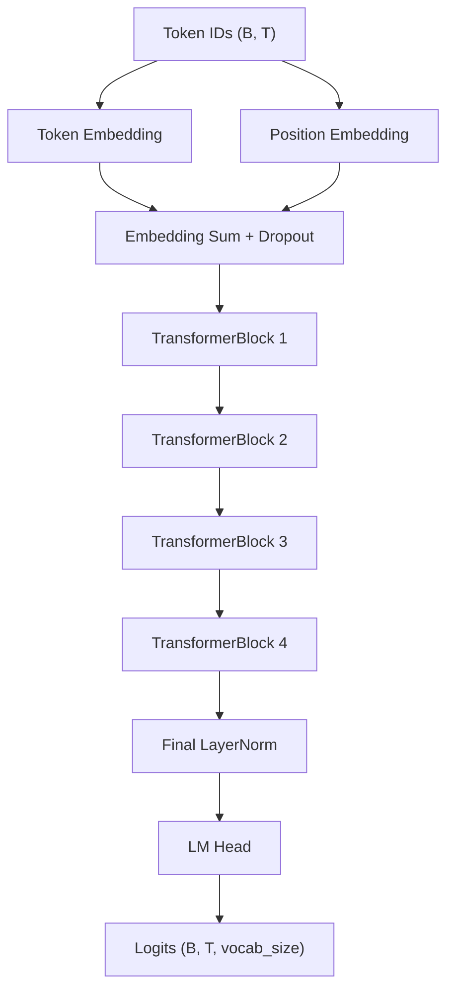

---

## 6. 사전 학습

### 6.1 하이퍼파라미터

| 구분 | 항목 | 값 |
| --- | --- | --- |
| BPE | train chars | 1,300,000 |
| BPE | vocab size | 3,000 |
| 모델 | context_length | 128 |
| 모델 | emb_dim | 192 |
| 모델 | n_heads | 4 |
| 모델 | n_layers | 4 |
| 모델 | qkv_bias | False |
| 학습 | batch_size | 16 |
| 학습 | stride | 128 |
| 학습 | epochs | 10 |
| 학습 | total steps | 3,930 |
| 학습 | eval_freq | every 100 steps |
| 학습 | eval_iter | 20 batches |
| 최적화 | learning rate | 0.0002 |
| 최적화 | weight_decay | 0.03 |
| 최적화 | scheduler | CosineAnnealingLR |
| 정규화 | drop_rate | 0.3 |
| checkpoint | 저장 경로 | `checkpoints/pretrain_vocab3000_ctx128_epoch10.pt` |

### 6.2 현재 사전학습 결과

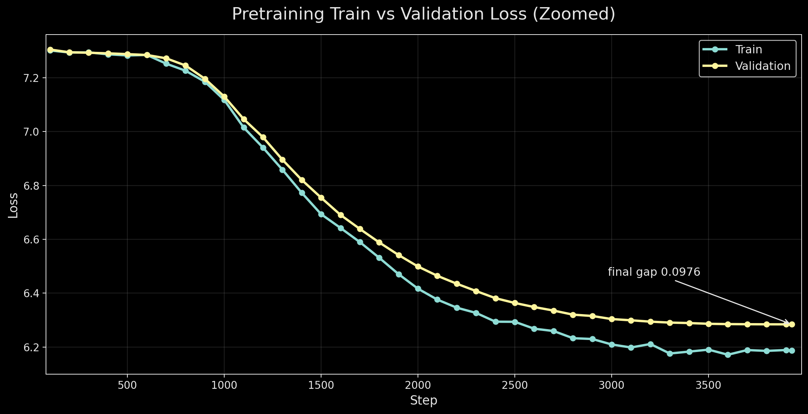

| step | train loss | val loss | train PPL | val PPL | lr |
| ---: | ---: | ---: | ---: | ---: | ---: |
| 0 | 8.1767 | 8.1778 | 3557.25 | 3561.04 | 0.000200 |
| 1000 | 7.1168 | 7.1296 | 1232.45 | 1248.39 | 0.000170 |
| 2000 | 6.4166 | 6.4989 | 611.93 | 664.44 | 0.000097 |
| 3000 | 6.2096 | 6.3039 | 497.48 | 546.71 | 0.000026 |
| 3930 | 6.1867 | 6.2843 | 486.21 | 536.07 | 0.000000 |

확대 그래프에서는 초기 step 0을 제외하고, train loss와 validation loss가 함께 움직이는 구간만 표시했다. loss와 perplexity는 꾸준히 내려갔지만, 후반에는 learning rate가 거의 0에 가까워지면서 validation loss가 6.28 근처에서 정체되었다. 이 결과는 모델이 다음 token 예측을 일부 학습했지만, 아직 자연스러운 문장 생성에는 부족하다는 뜻이다.

### 6.3 생성 샘플

| prompt | 생성 결과 |
| --- | --- |
| `이 영화` | `이영화를 더 좋다. 그 영화에 가까?` |
| `정말` | `... 0에 가한 감동이 참 잘는 아니다.` |

샘플에는 한국어 조각과 영화 리뷰에서 자주 나오는 단어가 보이지만, 문법과 의미 연결은 약하다. 특히 vocab size를 키운 실험에서는 token 종류가 늘어나 per-token 예측 난이도가 올라가므로 loss 숫자만으로 이전 실험과 직접 비교하기 어렵다.

### 6.4 사전학습 실험 흐름

사전학습 실험에서는 먼저 train loss가 흔들리고 train/validation 차이가 벌어지는 문제를 확인했다. 이후 drop rate, learning rate, weight decay를 조정하면서 train loss와 validation loss의 gap이 어떻게 변하는지 비교했다.

아래 이미지는 각 사전학습 실험 캡처에서 `Train vs Validation Loss` 부분만 잘라낸 것이다. 원래 여러 subplot이 있던 그래프에서 사전학습 흐름을 비교하는 데 필요한 train/validation 겹침 구간만 남기고, 실험별로 하나씩 크게 배치했다.

**실험 1: 기준 실험**

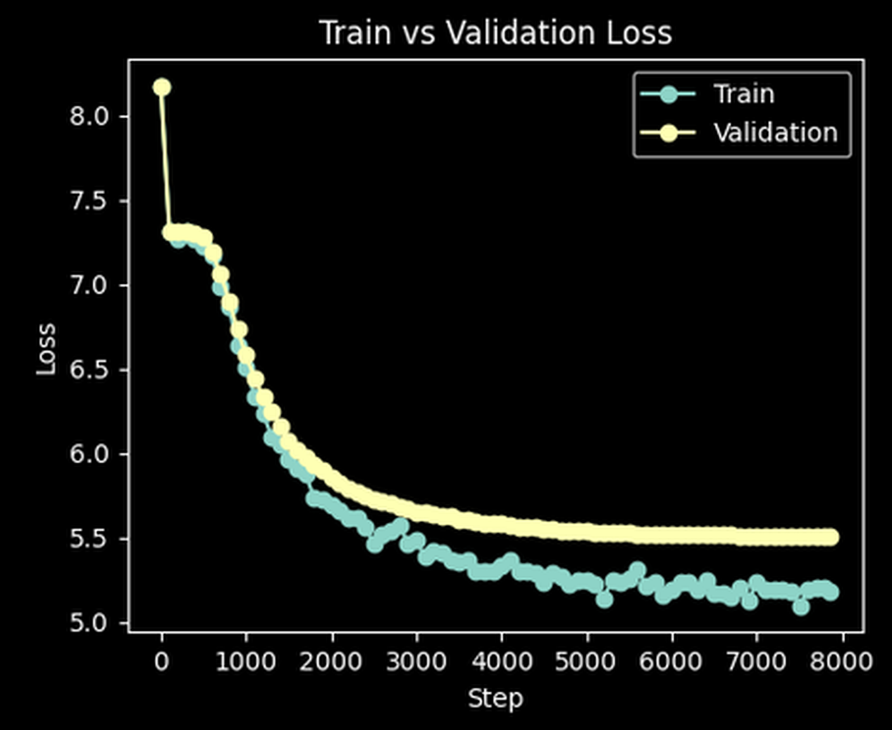

**실험 2: drop rate 0.2, learning rate 0.0002**

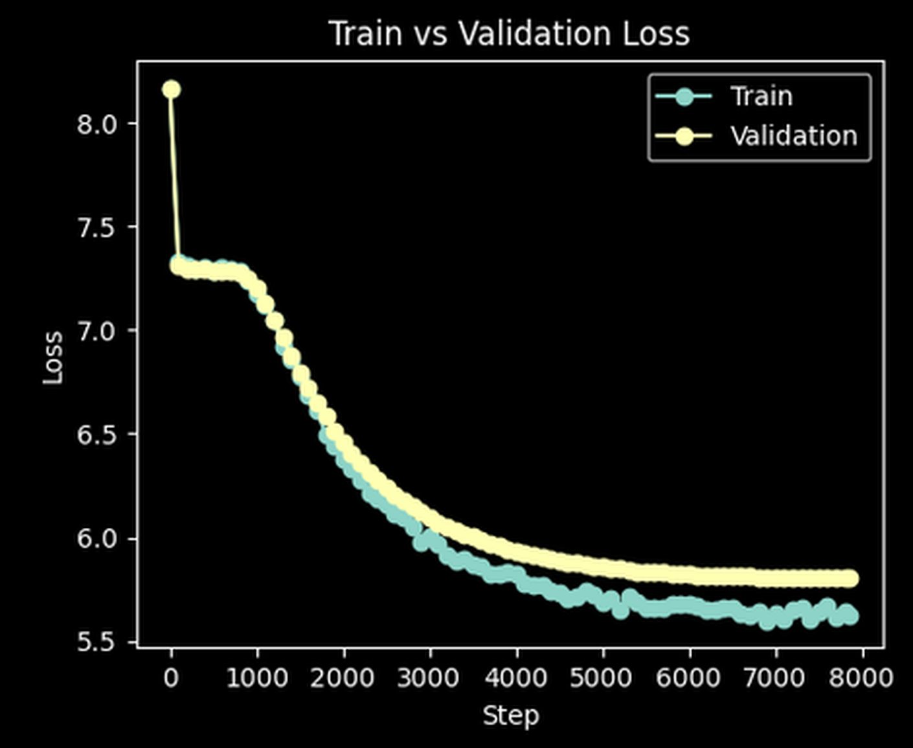

**실험 3: drop rate 0.3**

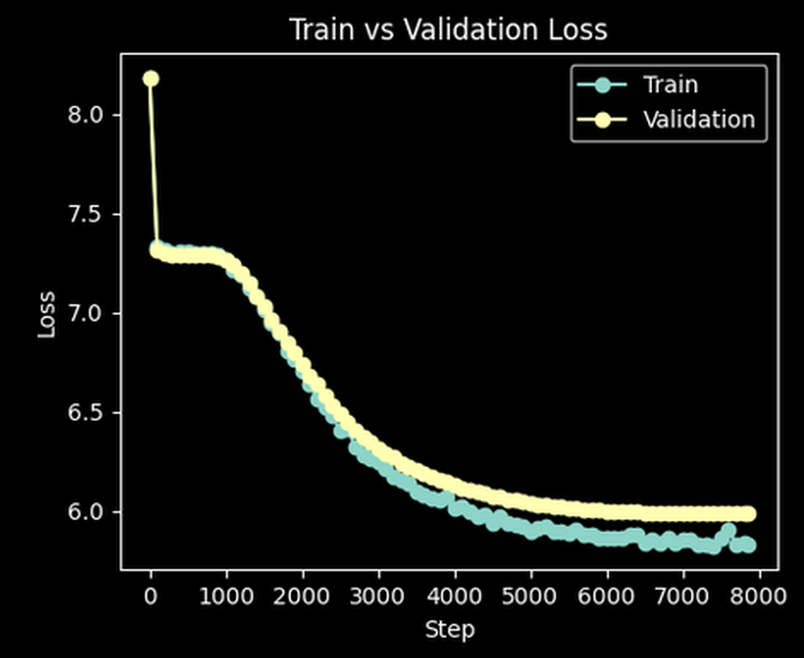

**실험 4: weight decay 0.03**

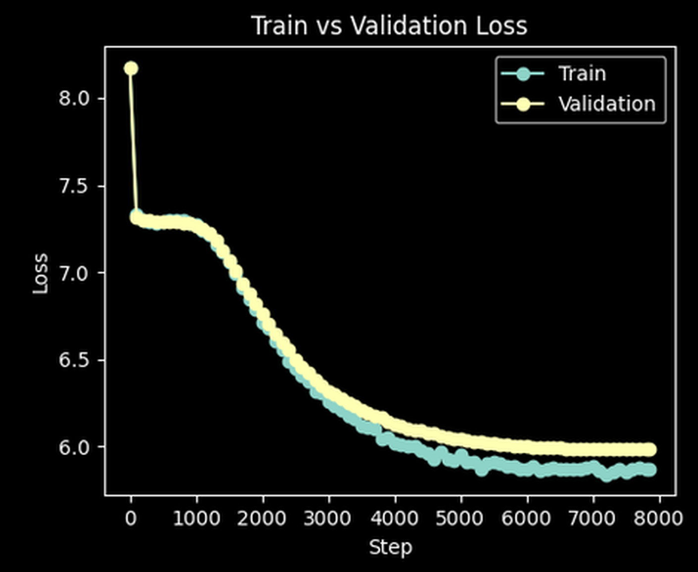

**최종 확인: train chars 130만, batch size 16**

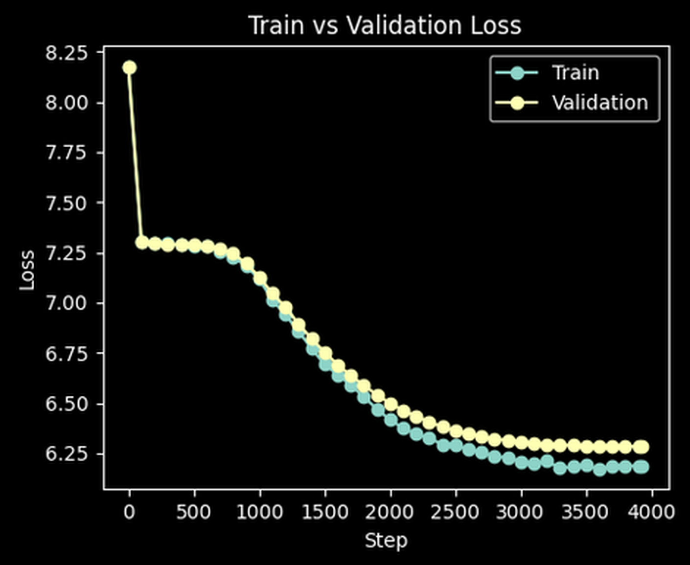

| 실험 | 주요 변경점 | final train loss | final val loss | train/val gap | 해석 |
| --- | --- | ---: | ---: | ---: | --- |
| 1 | 기준 실험: drop rate 0.1, lr 0.0003, weight decay 0.01 | 5.1841 | 5.5114 | 0.3273 | loss는 낮지만 gap이 커 과적합 경향이 보였다. |
| 2 | drop rate 0.2, lr 0.0002 | 5.6271 | 5.8076 | 0.1805 | loss 흔들림과 gap은 줄었지만 전체 loss는 상승했다. |
| 3 | drop rate 0.3 | 5.8269 | 5.9857 | 0.1588 | gap은 더 줄었지만 학습 자체가 더 느려졌다. |
| 4 | weight decay 0.03 | 5.8709 | 5.9851 | 0.1142 | 정규화가 강해져 gap은 가장 작아졌지만 loss는 높았다. |
| 최종 확인 | train chars 130만, batch size 16, drop rate 0.3 | 6.1867 | 6.2843 | 0.0976 | gap은 작지만 validation loss가 6.28 근처에서 정체되었다. |

이 흐름에서 gap은 0.3273에서 0.0976까지 줄었다. 다만 gap이 줄어든 것이 곧바로 더 좋은 생성 성능을 의미하지는 않았다. 실제로 정규화를 강하게 적용할수록 train loss와 validation loss의 차이는 줄었지만, loss 자체가 높아지고 생성 샘플은 여전히 어색했다. 따라서 사전학습 실험의 결론은 "과적합 gap은 줄일 수 있었지만, 현재 설정만으로 자연스러운 생성 품질을 얻기에는 부족하다"로 정리했다.

---

## 7. 미세 조정

| 항목 | 내용 |
| --- | --- |
| 구현 파일 | `src/finetune.py` |
| 과제 | NSMC 리뷰 긍정/부정 분류 |
| 데이터 포맷 | JSONL, `text`, `label` |
| 모델 구조 | pre-trained GPT backbone + dropout + linear classifier |
| 문장 대표 벡터 | padding이 아닌 마지막 token의 hidden state |
| max_length | 128 |
| batch_size | 16 |
| epochs | 10 |
| backbone learning rate | 3e-05 |
| classifier learning rate | 0.0005 |
| weight_decay | 0.01 |
| drop_rate | 0.2 |
| freeze backbone | False |
| train/validation/test samples | 20,000 / 3,000 / 3,000 |
| final validation loss / accuracy | 0.6246 / 0.6950 |
| test loss / accuracy | 0.5877 / 0.7150 |

### 7.1 Fine-tuning 학습 곡선

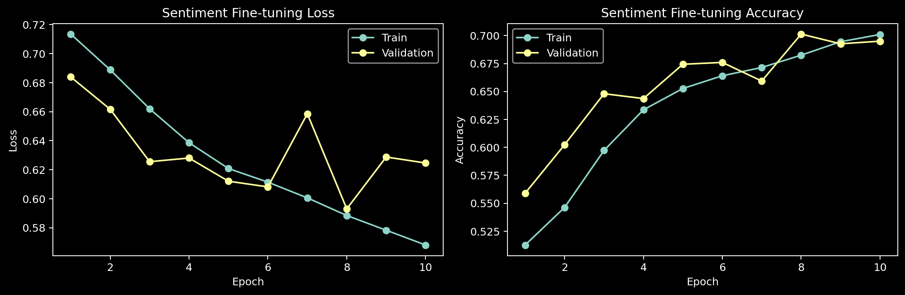

| epoch | train loss | train acc | val loss | val acc |
| ---: | ---: | ---: | ---: | ---: |
| 1 | 0.7135 | 0.5127 | 0.6839 | 0.5590 |
| 2 | 0.6888 | 0.5463 | 0.6616 | 0.6023 |
| 3 | 0.6620 | 0.5972 | 0.6256 | 0.6480 |
| 4 | 0.6386 | 0.6336 | 0.6281 | 0.6437 |
| 5 | 0.6208 | 0.6526 | 0.6121 | 0.6743 |
| 6 | 0.6115 | 0.6641 | 0.6082 | 0.6760 |
| 7 | 0.6006 | 0.6714 | 0.6585 | 0.6593 |
| 8 | 0.5885 | 0.6825 | 0.5931 | 0.7013 |
| 9 | 0.5783 | 0.6945 | 0.6288 | 0.6927 |
| 10 | 0.5681 | 0.7010 | 0.6246 | 0.6950 |

train accuracy는 0.51에서 0.70까지 꾸준히 상승했고, validation accuracy도 최고 0.7013까지 올라갔다. validation loss는 7 epoch와 9 epoch에서 튀는 구간이 있었지만, 전체 흐름은 개선 방향이었다.

### 7.2 Fine-tuning 실험 개선 비교

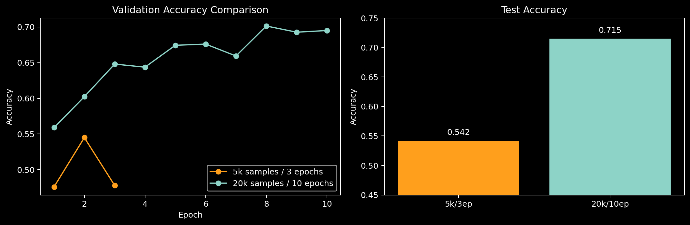

| 구분 | 이전 기준 실험 | 이번 실험 |
| --- | ---: | ---: |
| train samples | 5,000 | 20,000 |
| validation samples | 1,000 | 3,000 |
| test samples | 1,000 | 3,000 |
| epochs | 3 | 10 |
| backbone LR | 1e-05 | 3e-05 |
| classifier LR | 0.001 | 0.0005 |
| drop_rate | 0.1 | 0.2 |
| test loss | 0.6893 | 0.5877 |
| test accuracy | 0.5420 | 0.7150 |

이번 fine-tuning은 데이터 사용량과 epoch를 늘리고 classifier learning rate를 낮춘 결과, test accuracy가 0.5420에서 0.7150으로 상승했다. 사전학습 생성 샘플은 아직 어색했지만, backbone이 리뷰 표현을 어느 정도 학습했기 때문에 분류 head를 붙인 supervised task에서는 더 빠르게 성능이 올라간 것으로 보인다.

### 7.3 샘플 예측

| 입력 문장 | 예측 | 확신도 | 해석 |
| --- | --- | ---: | --- |
| `이 영화 정말 재미있고 감동적이었다` | positive | 0.982 | 긍정 표현을 잘 잡았다. |
| `시간이 아까울 정도로 지루했다` | negative | 0.877 | 부정 표현을 잘 잡았다. |
| `배우 연기는 좋았지만 이야기는 별로였다` | positive | 0.974 | `좋았지만`, `별로`가 함께 있는 대비 문장을 잘못 판단했다. |

오류 예시는 단순 긍정/부정 단어보다 문장 전체의 반전 구조를 이해해야 하는 경우다. 앞으로는 더 긴 학습, 더 안정적인 validation, attention 분석, hard example 확인이 필요하다.

### 7.4 팀원 추가 실험: Test 04와 Test 06

Test 04의 사전학습 checkpoint를 유지한 상태에서, fine-tuning 단계의 문장 대표 벡터 선택 방식만 바꾸는 가설을 세웠다. 기존 Test 04는 classification head에 넣을 벡터로 마지막 위치 `x[:, -1, :]`를 사용했는데, padding이 들어간 문장은 마지막 위치가 실제 리뷰 token이 아니라 `<pad>`일 수 있다. 따라서 Test 06에서는 마지막 위치를 그대로 쓰지 않고, padding을 제외한 마지막 실제 token의 hidden state를 사용했다.

#### Test 04 하이퍼파라미터

아래 값은 제공받은 `test_04_finetune_10epoch_metrics.json`, `test_06_padding_exclude_metrics.json`, `test_06_padding_exclude_best.pt`에서 확인한 값이다. Test 06은 Test 04에서 padding token 제외만 적용한 실험이므로, 모델 구조와 데이터 사용량은 Test 04와 동일한 조건으로 정리했다.

| 구분 | 항목 | 값 |
| --- | --- | --- |
| 모델 | vocab_size | 3,000 |
| 모델 | context_length | 64 |
| 모델 | emb_dim | 128 |
| 모델 | n_heads | 4 |
| 모델 | n_layers | 2 |
| 모델 | drop_rate | 0.2 |
| 모델 | qkv_bias | False |
| fine-tuning | train samples | 20,000 |
| fine-tuning | validation samples | 5,000 |
| fine-tuning | test samples | 5,000 |
| fine-tuning | epochs | 10 |
| Test 04 pooling | 문장 대표 벡터 | 마지막 위치 `x[:, -1, :]` |
| Test 06 pooling | 문장 대표 벡터 | 마지막 non-pad token hidden state |
| 파일에 미기록 | optimizer 세부값 | batch size, learning rate, weight decay, freeze 여부는 metrics/checkpoint에 없음 |

#### Test 04 결과

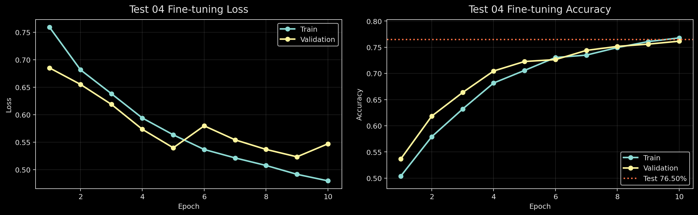

| 항목 | 값 |
| --- | ---: |
| final train loss | 0.4798 |
| final train acc | 0.7679 |
| final val loss | 0.5472 |
| final val acc | 0.7616 |
| test loss | 0.5221 |
| test acc | 0.7650 |

#### Test 06 결과: padding 제외 적용

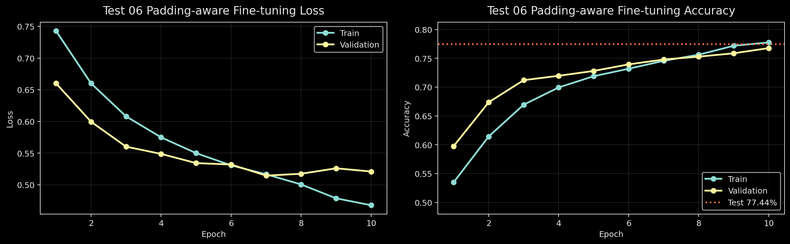

| 항목 | Test 04 | Test 06 | 변화 |
| --- | ---: | ---: | ---: |
| test loss | 0.5221 | 0.4925 | -0.0297 |
| test accuracy | 0.7650 | 0.7744 | +0.0094 |
| test accuracy (%) | 76.50% | 77.44% | +0.94%p |

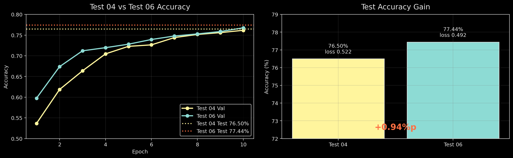

결과적으로 padding을 제외한 마지막 실제 token hidden state를 사용했을 때 test accuracy가 76.50%에서 77.44%로 상승했다. 이는 fine-tuning 성능 저하의 일부 원인이 backbone 자체가 아니라, 분류 head에 전달하는 문장 대표 벡터가 `<pad>` 위치를 참조하는 문제였다는 가설을 뒷받침한다.

---

## 8. 실험 환경

| 항목 | 내용 |
| --- | --- |
| Python | 3.11 계열 |
| PyTorch | 2.x 계열 |
| 주요 라이브러리 | `torch`, `numpy`, `matplotlib`, `pytest` |
| 실행 환경 | 로컬 Mac 및 GPU 사용 가능 환경에서 실험 |
| 금지 라이브러리 사용 여부 | 사용하지 않음 |
| 금지 항목 확인 | Hugging Face `transformers`, `datasets`, `tokenizers`, `sentencepiece`, `spacy`, `nltk`, `lightning`, `accelerate`, 외부 pretrained model, 외부 tokenizer vocabulary 미사용 |

---

## 9. 고찰

### 9.1 어려웠던 점

사전학습 loss가 낮아지는 것과 생성 샘플 품질이 항상 같이 좋아지지는 않았다. 특히 vocab size가 다른 실험은 loss의 기준 자체가 달라지기 때문에 단순히 "loss가 더 낮다"만으로 더 좋은 모델이라고 판단하기 어려웠다.

### 9.2 한국어 byte-level BPE에서 조심한 점

한국어는 한 글자가 여러 UTF-8 byte로 표현된다. byte-level BPE에서는 decode 과정에서 byte sequence가 다시 올바른 문자열로 복원되어야 하므로, encode/decode 일관성을 계속 확인했다. 또한 BPE vocabulary는 학습 시간이 오래 걸리므로 한 번 만든 뒤 JSON으로 저장하고 재사용하도록 구성했다.

### 9.3 사전학습 결과 해석

최종 사전학습은 validation loss 6.2843, validation perplexity 536.07에서 정체되었다. vocab size 3,000과 context length 128 설정은 더 많은 표현력을 줄 수 있지만, 현재 데이터와 step 수에서는 token 예측 난이도가 높아져 sample 품질이 크게 개선되지는 않았다.

### 9.4 Fine-tuning 결과 해석

감성 분류는 직접 진행한 실험에서 test accuracy 0.7150까지 상승했다. 이후 팀원 추가 실험에서는 동일 계열의 사전학습 checkpoint를 사용하되, 문장 대표 벡터에서 padding token을 제외하는 방식으로 test accuracy가 0.7744까지 상승했다. 이는 사전학습 모델이 완벽한 생성 모델은 아니더라도 리뷰 텍스트의 표현을 어느 정도 학습했고, fine-tuning 단계의 pooling 방식이 최종 분류 성능에 큰 영향을 줄 수 있음을 보여준다.

### 9.5 다음 개선 방향

| 개선 방향 | 기대 효과 |
| --- | --- |
| validation 기준 best checkpoint 저장 | 마지막 epoch보다 좋은 모델을 선택할 수 있다. |
| scheduler에 minimum LR 적용 | 후반 learning rate가 0에 가까워져 학습이 멈추는 문제를 줄일 수 있다. |
| eval_iter 증가 | train/validation loss 그래프의 흔들림을 더 정확히 볼 수 있다. |
| fine-tuning hard example 분석 | `좋았지만 별로였다` 같은 대비 문장 오류를 확인할 수 있다. |
| pooling 방식 비교 | 마지막 non-pad, 평균 pooling, BOS token pooling 중 어떤 방식이 감성 분류에 유리한지 비교할 수 있다. |
| sampling 방식 개선 | greedy decoding 대신 temperature/top-k를 사용해 생성 다양성을 확인할 수 있다. |
| 실험 로그 CSV 누적 | 하이퍼파라미터, 그래프, 샘플, 최종 성능을 한눈에 비교할 수 있다. |

---

## 10. 결론

이번 프로젝트에서는 tokenizer부터 GPT backbone, 사전학습, 감성 분류 fine-tuning까지 직접 구현했다. 사전학습에서는 loss와 perplexity가 감소했지만 생성 품질은 아직 제한적이었다. 반면 fine-tuning에서는 직접 실험 기준 test accuracy 0.7150을 달성했고, 팀원 추가 실험에서 padding token을 제외한 문장 대표 벡터를 사용해 test accuracy 0.7744까지 개선했다. 이를 통해 사전학습된 표현을 downstream task에 활용할 수 있으며, fine-tuning에서는 classification head에 어떤 hidden state를 넘기는지가 성능에 중요하다는 점을 확인했다.
