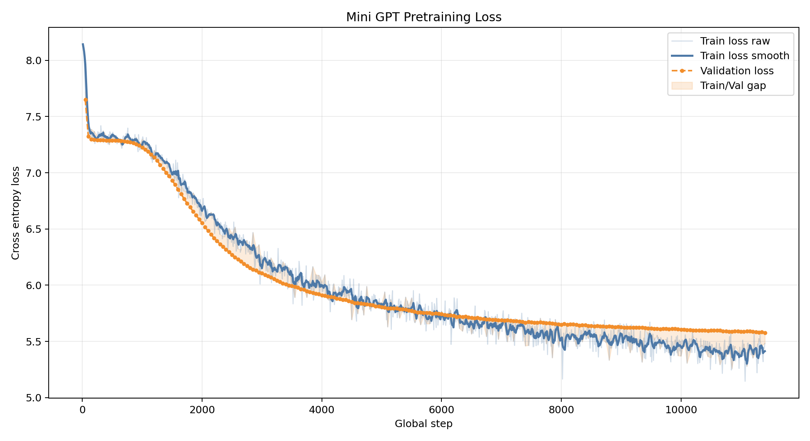
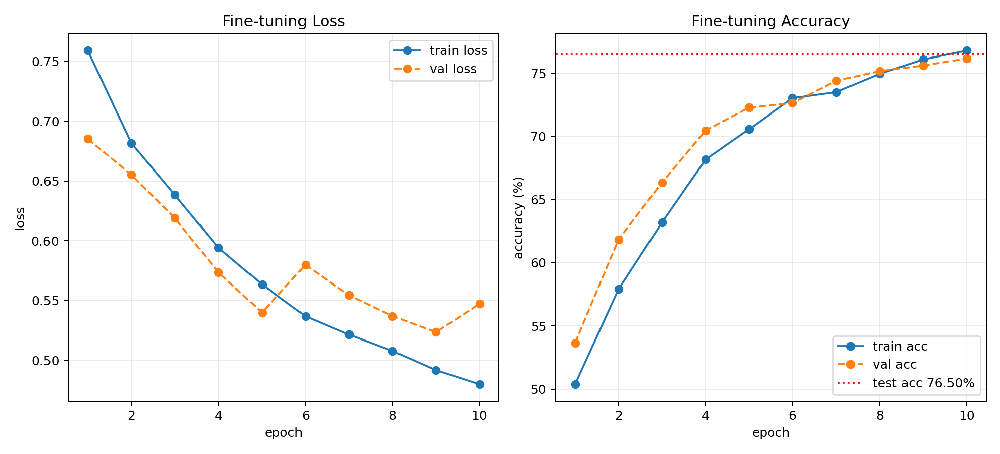

# Test 04 Final Report - Dropout 0.2 사전학습 및 감성 분류 미세튜닝

## 1. 실험 가설

Test 02에서는 `drop_rate=0.1`로 사전학습했을 때 validation loss는 가장 낮았지만, 후반부 train/validation gap이 다소 벌어졌다.
Test 03에서는 `drop_rate=0.3`으로 gap은 줄었지만, 규제가 강해져 validation loss가 높게 남았다.

따라서 Test 04에서는 중간값인 `drop_rate=0.2`를 적용했다.

> Test 04 가설: dropout 0.2는 Test 03보다 validation 성능을 회복하면서, Test 02보다 train/validation gap을 줄이는 균형점이 될 것이다.

이후 Test 04 사전학습 checkpoint를 사용해 NSMC 긍정/부정 감성 분류 미세튜닝을 진행했다.

## 2. 사전학습 설정

| 항목 | 값 |
| --- | --- |
| 실험 번호 | Test 04 |
| 변경한 하이퍼파라미터 | `drop_rate: 0.3 -> 0.2` |
| device | CUDA GPU |
| tokenizer | UTF-8 byte-level BPE |
| vocab size | 3,000 |
| train text size | 1,000,000 characters |
| validation text size | 100,000 characters |
| context length | 64 |
| embedding dim | 128 |
| attention heads | 4 |
| transformer layers | 2 |
| qkv bias | False |
| planned epochs | 20 |
| max steps | 0, 제한 없음 |
| 실제 global step | 11,400 |
| checkpoint resume | 사용하지 않음 |

## 3. 사전학습 결과

| 항목 | 시작 | 마지막 | 변화 |
| --- | ---: | ---: | ---: |
| train loss | 8.1426 at step 10 | 5.4828 at step 11400 | -2.6599 |
| validation loss | 7.6503 at step 50 | 5.5774 at step 11400 | -2.0729 |



Test 04는 Test 03보다 train loss와 validation loss가 모두 낮아졌다.
동시에 Test 02보다 train/validation gap은 작게 유지되었다.
따라서 사전학습만 놓고 보면 `drop_rate=0.2`는 성능과 과적합 완화 사이의 균형점으로 볼 수 있다.

## 4. 사전학습 비교

| 항목 | Test 02 | Test 03 | Test 04 |
| --- | ---: | ---: | ---: |
| drop_rate | 0.1 | 0.3 | 0.2 |
| global step | 11,400 | 11,400 | 11,400 |
| final train loss | 5.3018 | 5.6488 | 5.4828 |
| final validation loss | 5.5441 | 5.6377 | 5.5774 |
| final gap `(val - train)` | +0.2424 | -0.0110 | +0.0947 |

Test 02는 validation loss가 가장 낮지만 train/validation gap이 가장 크다.
Test 03은 gap은 가장 작지만 validation loss가 높다.
Test 04는 두 결과의 중간에 위치하므로, 미세튜닝 후보 checkpoint로 사용하기에 적절하다고 판단했다.

## 5. 사전학습 생성 샘플 관찰

초기 샘플은 의미 없는 반복과 어색한 조사가 많았다.

```text
[prompt] 이 영화는
이 영화는가,한 영화나을가어하고고영화도은게나나이이은고...

[prompt] 정말
정말도다도.에지는의.게에아지.한를...
```

20 epoch 이후에는 한글이 안정적으로 나오고 영화 리뷰 말투가 분명해졌다.

```text
[prompt] 이 영화는
이 영화는 재밌네요
영화관에서 본 기억이 난해...

[prompt] 정말
정말 재밌던데...ㅠㅠ
정말 재미없었으면 진짜 재밌게봤습니다.
```

다만 문장 의미는 여전히 어색하다.
긍정 표현과 부정 표현이 섞이고, 문장 전체의 일관성은 부족하다.
따라서 현재 사전학습 모델은 리뷰 말투와 자주 등장하는 표현은 학습했지만, 긴 문장의 의미 일관성을 안정적으로 유지하는 수준은 아니다.

## 6. 미세튜닝 설정

Test 04 사전학습 checkpoint를 GPT backbone으로 사용하고, 그 위에 감성 분류용 classification head를 붙여 NSMC 긍정/부정 분류 미세튜닝을 진행했다.

| 항목 | 값 |
| --- | --- |
| backbone checkpoint | Test 04 pretraining checkpoint |
| classifier | `GPTForSequenceClassification` |
| num labels | 2, 부정/긍정 |
| train samples | 20,000 |
| validation samples | 5,000 |
| test samples | 5,000 |
| fine-tuning epochs | 10 |
| optimizer | AdamW |
| learning rate | 1e-4 |
| weight decay | 0.01 |
| batch size | 32 |
| 이어서 학습 여부 | 5 epoch checkpoint에서 10 epoch까지 추가 학습 |

## 7. 미세튜닝 결과

| epoch | train loss | val loss | train acc | val acc |
| ---: | ---: | ---: | ---: | ---: |
| 1 | 0.7592 | 0.6852 | 50.38% | 53.66% |
| 2 | 0.6818 | 0.6553 | 57.91% | 61.84% |
| 3 | 0.6383 | 0.6189 | 63.20% | 66.36% |
| 4 | 0.5941 | 0.5736 | 68.17% | 70.46% |
| 5 | 0.5635 | 0.5399 | 70.57% | 72.28% |
| 6 | 0.5369 | 0.5799 | 73.04% | 72.64% |
| 7 | 0.5215 | 0.5544 | 73.50% | 74.40% |
| 8 | 0.5077 | 0.5370 | 74.95% | 75.16% |
| 9 | 0.4917 | 0.5235 | 76.09% | 75.60% |
| 10 | 0.4798 | 0.5472 | 76.79% | 76.16% |

최종 test 결과는 다음과 같다.

| 항목 | 값 |
| --- | ---: |
| test loss | 0.5221 |
| test accuracy | 76.50% |



## 8. 미세튜닝 해석

5 epoch 결과와 비교하면 test accuracy가 `73.46% -> 76.50%`로 상승했다.
따라서 5 epoch에서 학습을 멈추기에는 아직 이른 상태였고, 10 epoch까지 추가 학습한 것이 분류 성능 개선에 도움이 되었다.

다만 validation loss는 9 epoch에서 가장 낮았다.

```text
epoch 9  val loss: 0.5235
epoch 10 val loss: 0.5472
```

반면 validation accuracy는 10 epoch까지 계속 상승했다.

```text
epoch 9  val acc: 75.60%
epoch 10 val acc: 76.16%
```

즉, loss 기준으로는 9 epoch가 가장 안정적일 수 있고, accuracy 기준으로는 10 epoch가 더 좋다.
감성 분류 과제의 최종 지표가 accuracy라면 10 epoch 결과를 최종 결과로 사용할 수 있다.
하지만 validation loss 상승은 과적합 초기 신호일 수 있으므로, 10 epoch 이후 추가 학습은 신중하게 판단해야 한다.

## 9. 사전학습과 미세튜닝 연결

Test 04 사전학습은 Test 02보다 validation loss는 조금 높았지만 train/validation gap이 더 안정적이었다.
미세튜닝에서는 Test 04 checkpoint가 10 epoch 기준 test accuracy 76.50%를 달성했다.

이는 Test 04 checkpoint가 감성 분류에 사용할 수 있는 유효한 사전학습 모델임을 보여준다.
다만 Test 02 checkpoint를 동일한 조건으로 미세튜닝하지 않았기 때문에, 최종적으로 Test 04가 Test 02보다 우수하다고 단정할 수는 없다.

최종 비교를 위해서는 다음 실험이 필요하다.

| 비교 대상 | 확인할 질문 |
| --- | --- |
| Test 02 checkpoint fine-tuning | 사전학습 validation loss가 더 낮은 모델이 분류 accuracy도 더 높은가? |
| Test 04 checkpoint fine-tuning | 사전학습 gap이 안정적인 모델이 분류에서도 더 잘 일반화되는가? |

## 10. 최종 결론

Test 04는 사전학습 단계에서 `drop_rate=0.2`가 성능과 과적합 완화 사이의 균형점이 될 수 있음을 보여주었다.
미세튜닝 단계에서는 10 epoch까지 학습했을 때 test accuracy 76.50%를 달성했다.

현재까지의 결론은 다음과 같다.

```text
사전학습 기준:
Test 04는 Test 02보다 validation loss는 조금 높지만 gap이 안정적이다.

미세튜닝 기준:
Test 04 checkpoint는 10 epoch 미세튜닝에서 test accuracy 76.50%를 달성했다.

주의점:
validation loss는 9 epoch에서 최저이고 10 epoch에서 상승했다.
따라서 추가 epoch는 과적합 여부를 확인하며 조심스럽게 진행해야 한다.
```

최종 보고서에는 Test 04를 “현재까지 가장 균형적인 사전학습 + 미세튜닝 후보”로 기록할 수 있다.
다만 최종 모델 선택을 위해서는 Test 02 checkpoint도 동일 조건으로 미세튜닝하여 비교하는 것이 가장 설득력 있다.

