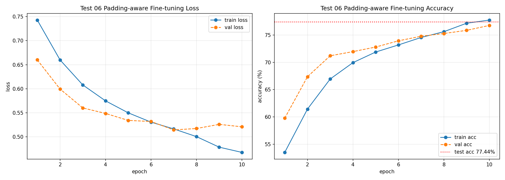

# Test 06 Report - Padding-aware Fine-tuning

## 1. 실험 목적

Test 06은 Test 04 사전학습 checkpoint를 사용하되, 미세튜닝 단계에서 문장 대표 벡터를 선택하는 방식을 수정한 실험이다.

기존 감성 분류 모델은 Transformer 출력에서 마지막 위치의 hidden state를 사용했다.

```python
sentence_vec = x[:, -1, :]
```

하지만 리뷰가 `max_length`보다 짧으면 마지막 위치는 실제 토큰이 아니라 `<pad>` 토큰일 수 있다.

따라서 Test 06에서는 `<pad>`가 아닌 마지막 실제 토큰의 hidden state를 문장 대표 벡터로 사용하도록 바꾸었다.

## 2. 실험 가설

짧은 리뷰에서 마지막 위치가 `<pad>`라면, 기존 방식은 문장 자체가 아니라 padding 위치의 hidden state를 대표 벡터로 사용할 수 있다.

따라서 마지막 `<pad>` 위치가 아니라 마지막 실제 토큰 위치의 hidden state를 사용하면 감성 분류 정확도가 개선될 것이다.

## 3. 변경 사항

| 구분 | 기존 방식 | Test 06 |
| --- | --- | --- |
| 문장 대표 벡터 | 마지막 위치 `x[:, -1, :]` | 마지막 non-pad token 위치 |
| padding 처리 | 마지막 위치가 pad여도 그대로 사용 가능 | pad 위치 제외 |
| 변경 위치 | fine-tuning classification forward | fine-tuning classification forward |

핵심 변경은 다음과 같다.

```python
valid_mask = input_ids != pad_id
lengths = valid_mask.sum(dim=1).clamp(min=1)
last_indices = lengths - 1
sentence_vec = x[batch_indices, last_indices, :]
```

## 4. 실험 설정

| 항목 | 값 |
| --- | --- |
| 실험 번호 | Test 06 |
| 사전학습 checkpoint | Test 04 checkpoint |
| fine-tuning train samples | 20,000 |
| validation samples | 5,000 |
| test samples | 5,000 |
| epoch | 10 |
| optimizer | AdamW |
| learning rate | 1e-4 |
| weight decay | 0.01 |
| 변경한 변수 | 마지막 non-pad token hidden state 사용 |
| 저장 checkpoint | `test_06_padding_exclude_best.pt` |

## 5. 학습 결과

| epoch | train loss | train acc | val loss | val acc |
| --- | ---: | ---: | ---: | ---: |
| 1 | 0.7427 | 53.49% | 0.6600 | 59.76% |
| 2 | 0.6600 | 61.43% | 0.5995 | 67.36% |
| 3 | 0.6080 | 66.95% | 0.5602 | 71.20% |
| 4 | 0.5749 | 69.94% | 0.5488 | 71.96% |
| 5 | 0.5500 | 71.89% | 0.5342 | 72.80% |
| 6 | 0.5307 | 73.19% | 0.5320 | 73.94% |
| 7 | 0.5166 | 74.56% | 0.5145 | 74.78% |
| 8 | 0.5006 | 75.62% | 0.5174 | 75.28% |
| 9 | 0.4786 | 77.17% | 0.5260 | 75.86% |
| 10 | 0.4677 | 77.75% | 0.5209 | 76.76% |



## 6. Test Accuracy 점선 의미

그래프 오른쪽의 빨간 점선은 epoch별 값이 아니라, 최종 저장된 모델을 test dataset에 한 번 평가한 결과다.

```text
test accuracy: 77.44%
```

train accuracy와 validation accuracy는 epoch마다 계산되므로 선 그래프로 변한다.

반면 test accuracy는 학습이 끝난 뒤 최종 checkpoint를 대상으로 한 번 측정한 값이므로, 모든 epoch 구간에 동일한 수평 점선으로 표시했다.

즉 빨간 점선은 "이 모델의 최종 test 기준선"이며, validation accuracy가 이 기준선에 얼마나 가까워지는지 비교하기 위한 참고선이다.

## 7. 최종 Test 결과

| 항목 | 값 |
| --- | ---: |
| test loss | 0.4925 |
| test accuracy | 77.44% |
| best checkpoint | `test_06_padding_exclude_best.pt` |

## 8. Test 04와 비교

| 항목 | Test 04 | Test 06 |
| --- | ---: | ---: |
| train samples | 20,000 | 20,000 |
| epoch | 10 | 10 |
| 대표 벡터 선택 | 마지막 위치 `x[:, -1, :]` | 마지막 non-pad token |
| validation accuracy | 76.16% | 76.76% |
| test accuracy | 76.50% | 77.44% |

Test 06은 Test 04와 비교해 validation accuracy와 test accuracy가 모두 상승했다.

```text
validation accuracy: 76.16% -> 76.76% (+0.60%p)
test accuracy: 76.50% -> 77.44% (+0.94%p)
```

따라서 padding 위치를 문장 대표 벡터로 사용하는 문제를 줄인 것이 감성 분류 성능에 긍정적인 영향을 준 것으로 해석할 수 있다.

## 9. 해석

Test 06의 train loss는 0.7427에서 0.4677까지 꾸준히 감소했다.

validation loss도 초반에는 0.6600에서 0.5145까지 감소했지만, epoch 8 이후에는 약간 흔들렸다.

validation accuracy는 59.76%에서 76.76%까지 계속 상승했다.

이는 모델이 분류 문제를 계속 학습하고 있음을 보여준다.

다만 validation loss가 epoch 7 이후 완전히 안정적으로 감소하지는 않았으므로, 10 epoch 이후 추가 학습은 과적합 가능성을 확인하면서 진행해야 한다.

## 10. 결론

Test 06은 Test 04와 같은 데이터 수와 epoch 조건에서, 문장 대표 벡터를 마지막 실제 토큰 위치로 바꾼 실험이다.

결과적으로 test accuracy가 76.50%에서 77.44%로 상승했다.

개선 폭은 크지 않지만, 짧은 리뷰에서 `<pad>` 위치를 대표 벡터로 사용하는 문제를 줄였다는 점에서 구조적으로 더 타당한 방식이다.

따라서 이후 fine-tuning 구현에서는 마지막 위치 `x[:, -1, :]`를 사용하는 방식보다, 마지막 non-pad token hidden state를 사용하는 방식이 더 적절하다.
